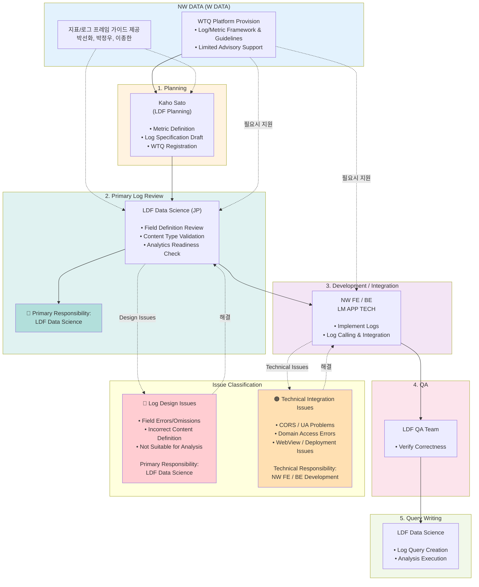

# JP Character Chat Log Design & Review Process

## 전체 프로세스 플로우

## 핵심 원칙

### 🎯 로그 검수의 1차 책임: Data Science (DS)
- 로그는 "분석을 위한 자산"
- 분석에 쓰이는 로그 → 분석가가 검수
- W Data는 **형식/프레임 제공자** 역할

### 🚫 하지 않는 것
- ❌ W Data에서 JP 로그 검수
- ❌ 로그 이슈를 개인 단위로 처리 (DM Black Box)

### ✅ 권장 방식
- **Option 1**: Kaho ↔ 개발 직접 커뮤니케이션
- **Option 2**: Kaho ↔ DS ↔ 개발
- DS에서 해결 불가한 경우에만 W Data 지원 요청

## R&R 정리

| 역할 | 담당자 | 책임 사항 |
|------|--------|----------|
| **일본 지표 정의 및 WTQ 등록** | KAHO SATO (LDF 기획) | Metric Definition, Log Spec Draft, WTQ Registration |
| **로그 설계 검수 (1차 책임)** | LDF Data Science (JP) | Field Definition Review, Content Type Validation, Analytics Check |
| **QA** | LDF QA | Verify Correctness |
| **로그 개발/연동/기술 이슈 대응** | W FE Tech, LM APP TECH | Implement Logs, Log Integration, Technical Issues |
| **지표/로그 프레임 가이드 제공** | 박선화, 박정우, 이종한 (NW DATA) | WTQ Platform, Framework & Guidelines, Limited Advisory |

## 이슈 분류

### 🔴 로그 설계 단계 이슈
- 일부 필드 누락 / 오기입
- Content Type 정의 오류
- 분석 가능성 부족
- **책임**: LDF Data Science

### 🟠 로그 호출 및 연동 단계 이슈
- CORS 에러
- UA 전달 방식 문제
- WebView 호출 이슈
- QA 환경 연동 문제
- **책임**: NW FE / BE

## 기대 효과
✅ 로그 품질 책임 주체 명확화  
✅ 향후 동일 이슈 재발 방지  
✅ 효율적인 커뮤니케이션 경로 확립

## 기타 논의사항
- deviceId 없이 연동 가능 여부
- Web의 경우 UB 없이 지표 생성 영향도
